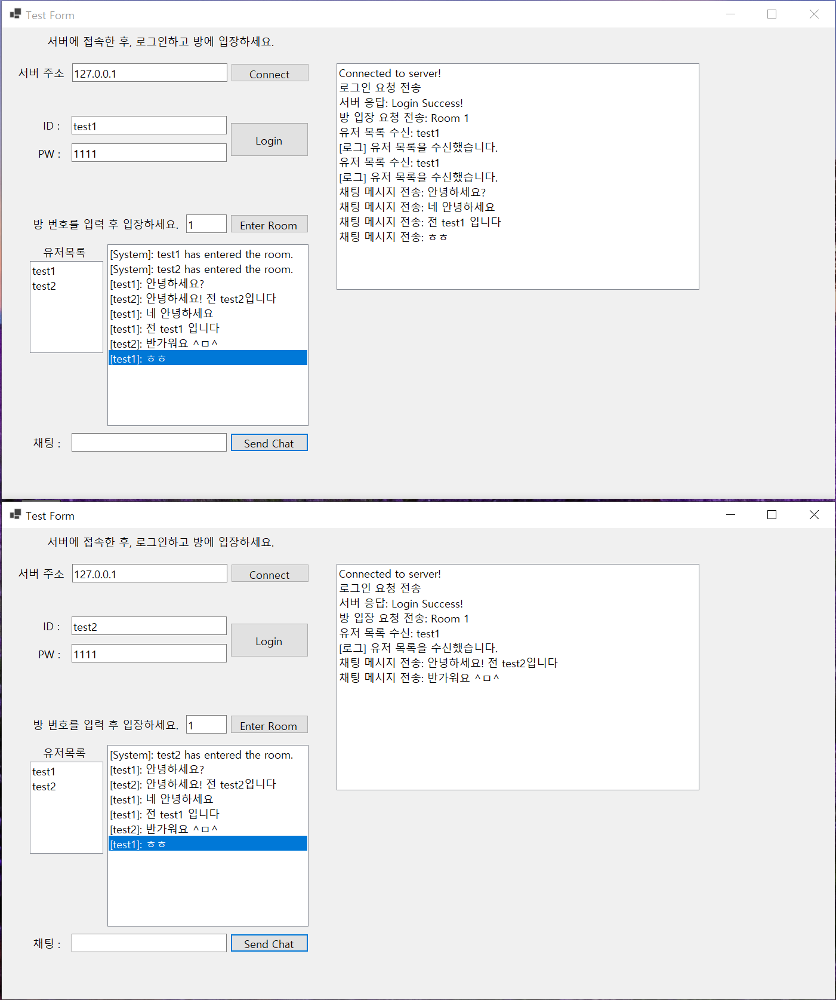

# ChatServerAcl

이 프로젝트는 Visual C++ 환경에서 오픈 소스 네트워크 프레임워크인 ACL(Advanced C/C++ Library)을 활용하여 구현한 채팅 서버입니다. <br>
이 서버는 코루틴을 이용한 비동기 처리, Redis를 활용한 사용자 인증, 그리고 C++과 C# 간의 직렬화된 데이터를 주고받는 기능을 포함합니다.
<br>
이 서버의 클라이언트는 [📁WinFormsClient 디렉토리](../WinFormsClient)에 존재합니다.

## 프로젝트 구조

```
ChatServerAcl/
├── main.cpp               # 프로젝트의 메인 엔트리 포인트로서 서버 구동 로직을 포함.
├── PacketDefinition.cpp   # 직렬화 및 역직렬화에 관한 패킷 정의 구현 파일.
├── PacketDefinition.h     # 패킷 정의와 관련된 클래스 및 구조체 선언 파일.
├── pch.h                  # 프로젝트에서 공통적으로 사용되는 헤더 파일들.
├── RoomManager.cpp        # 방 관리 및 사용자 메시지 브로드캐스트 로직 구현 파일.
├── RoomManager.h          # 방 관리 클래스 선언 파일.
├── tcpCoroutine.cpp       # TCP 코루틴 서버의 실행 로직 구현 파일.
└── tcpCoroutine.h         # TCP 코루틴 서버 관련 함수 및 클래스 선언 파일.
```

## 각 파일의 역할

### 1. `main.cpp`
- 이 파일은 서버의 진입점을 정의하고 있으며, 서버 구동 및 이벤트 루프를 설정하는 역할을 합니다.
- ACL 라이브러리와 코루틴을 활용하여 비동기 처리를 수행합니다.

### 2. `PacketDefinition.cpp` & `PacketDefinition.h`
- 이 파일들은 서버와 클라이언트 간 통신에 사용되는 패킷 구조를 정의하고, 패킷의 직렬화 및 역직렬화를 처리합니다. 
- 예를 들어, 로그인 요청, 방 입장 요청, 채팅 메시지 등을 직렬화된 바이너리 포맷으로 변환해 전송하거나, 수신된 데이터를 역직렬화해 해석하는 로직이 포함되어 있습니다.

### 3. `RoomManager.cpp` & `RoomManager.h`
- 이 파일들은 서버 내의 채팅방을 관리하는 로직을 구현합니다.
- 각 방에 사용자를 추가하거나 제거하고, 해당 방에 있는 모든 사용자에게 메시지를 브로드캐스트하는 기능을 제공합니다.

### 4. `tcpCoroutine.cpp` & `tcpCoroutine.h`
- 이 파일들은 서버의 TCP 연결 및 코루틴 처리 로직을 구현합니다.
- 코루틴을 활용해 여러 클라이언트와 비동기적으로 통신을 처리하며, 서버의 주 실행 흐름을 관리합니다.

### 5. `pch.h`
- 프로젝트에서 자주 사용되는 라이브러리나 헤더 파일들을 포함하는 프리컴파일 헤더 파일입니다.
- 이를 통해 컴파일 시간을 줄이고 코드의 일관성을 유지합니다.


## 주요 기능

### 1. Redis를 사용한 로그인
이 서버는 사용자 인증을 위해 Redis를 사용합니다. 사용자가 로그인 요청을 보내면 서버는 Redis 데이터베이스에서 해당 사용자의 ID/PW를 조회 후 인증합니다.

- **로그인 과정**:  
  1. 클라이언트가 `ReqLogin` 패킷을 서버로 전송합니다.  
  2. 서버는 Redis에서 사용자의 `UserID`를 조회하고, 저장된 비밀번호(`AuthToken`)와 클라이언트가 보낸 비밀번호를 비교합니다.  
  3. 일치할 경우 "Login Success!" 메시지를, 실패할 경우 "Login Failed!" 메시지를 클라이언트에 전송합니다.

```cpp
case PacketID::ReqLogin: {
    LoginRequest loginRequest = LoginRequest::Deserialize(buf);
    acl::string storedPassword;
    bool userExists = cmd.get(loginRequest.UserID.data(), storedPassword);

    if (userExists && storedPassword == loginRequest.AuthToken.data()) {
        std::string successMessage = "Login Success!";
        conn->write(successMessage.c_str(), successMessage.size());
    } else {
        std::string failureMessage = "Login Failed!";
        conn->write(failureMessage.c_str(), failureMessage.size());
    }
    break;
}
```

### 2. 채팅 기능
서버는 여러 사용자가 하나의 채팅방에 입장하여 서로 메시지를 주고받을 수 있는 기능을 제공합니다. 각 사용자가 보내는 메시지는 서버에서 받아 해당 방의 모든 사용자에게 브로드캐스트됩니다.

- **채팅 메시지 브로드캐스트**:  
  1. 사용자가 채팅방에 입장한 후, 클라이언트는 `ReqRoomChat` 패킷을 서버에 전송합니다.  
  2. 서버는 해당 메시지를 같은 방에 있는 모든 사용자에게 `NtfRoomChat` 패킷으로 브로드캐스트합니다. 
  
```cpp
void RoomManager::BroadcastMessage(int roomNumber, const std::string& message, const std::string& senderID) {
    RoomChatNotification notification;
    notification.TotalSize = sizeof(RoomChatNotification);
    notification.Id = PacketID::NtfRoomChat;
    std::strncpy(notification.UserID.data(), senderID.c_str(), notification.UserID.size() - 1);
    std::strncpy(notification.Message.data(), message.c_str(), notification.Message.size() - 1);

    std::array<std::byte, sizeof(RoomChatNotification)> buffer{};
    notification.Serialize(buffer);

    std::cout << "Broadcasting Message: [" << senderID << "] " << message << " to all clients." << std::endl;
    Broadcast(roomNumber, buffer);
}
```

### 3. C#과 C++ 사이의 패킷 직렬화 기법

이 프로젝트에서는 C++과 C# 간의 통신에서 패킷을 주고받기 위해 직접 구현한 **커스텀 직렬화** 방식을 사용합니다. <br>
이 방식은 사용자 정의된 직렬화 포맷을 통해 데이터를 효율적으로 처리하며, 직렬화된 데이터를 안전하게 전송합니다.

- **Protocol Buffer 소개**:  
 * [🌐Protocol Buffers](https://protobuf.dev/)와 같은 오픈소스 데이터 직렬화 형식은 데이터를 효율적으로 인코딩하고, 여러 언어에서 쉽게 해석할 수 있도록 도와줍니다.
 * 하지만 이 프로젝트에서는 C++에서 직접 패킷 구조를 정의 후 직렬화하는 과정 학습을 위해 커스텀 직렬화 방식을 채택했습니다.

- **C++23의 `std::span` 및 `std::byte` 사용**:
  C++23에서 제공하는 `std::span`과 `std::byte`를 사용하여, 메모리 관리의 안정성과 효율성을 높였습니다. `std::span`을 사용해 버퍼를 관리하고, `std::byte`를 통해 바이트 단위의 데이터 처리가 더욱 명확해졌습니다.

```cpp
// PacketDefinition.h
struct PacketHeader {
    uint16_t TotalSize;
    PacketID Id;
    uint8_t Type;

    void Serialize(std::span<std::byte> buffer) const;
    [[nodiscard]] static PacketHeader Deserialize(std::span<const std::byte> buffer);
};
```

- **패킷 직렬화와 역직렬화**:
  각 패킷은 `Serialize` 및 `Deserialize` 함수를 통해 메모리 버퍼에 데이터를 기록하거나 읽습니다. 이를 통해 C++과 C# 간의 데이터를 안전하고 효율적으로 주고받을 수 있습니다.

```cpp
// PacketDefinition.cpp
void PacketHeader::Serialize(std::span<std::byte> buffer) const {
    auto it = buffer.begin();
    std::memcpy(&*it, &TotalSize, sizeof(TotalSize));
    std::memcpy(&*(it + sizeof(TotalSize)), &Id, sizeof(Id));
    std::memcpy(&*(it + sizeof(TotalSize) + sizeof(Id)), &Type, sizeof(Type));
}

PacketHeader PacketHeader::Deserialize(std::span<const std::byte> buffer) {
    PacketHeader header;
    auto it = buffer.begin();
    std::memcpy(&header.TotalSize, &*it, sizeof(header.TotalSize));
    std::memcpy(&header.Id, &*(it + sizeof(header.TotalSize)), sizeof(header.Id));
    std::memcpy(&header.Type, &*(it + sizeof(header.TotalSize) + sizeof(header.Id)), sizeof(header.Type));
    return header;
}
```

이와 같은 방식으로 패킷을 주고받으며, C++과 C# 간의 원활한 데이터 통신을 제공합니다.

<br>

## 실습 캡쳐

채팅 프로젝트의 실행 결과를 캡처한 화면입니다:

 


## 결론
이 프로젝트는 ACL 라이브러리를 활용하여 TCP 서버와 클라이언트 간의 채팅 시스템을 구축하는 실습 프로젝트입니다. <br>
주요 기능으로 Redis를 사용한 로그인 인증, 방을 관리하는 채팅 기능, C++과 C# 간의 커스텀 직렬화 방식을 구현하여 서버와 클라이언트 간의 원활한 통신을 실현합니다. <br>


----

# C++23 리팩토링 개념 및 수정 사항 정리

C++23로 리팩토링을 진행하면서, 최신 C++ 표준의 기능들을 적용하여 코드의 안정성과 가독성을 개선할 수 있습니다. <br>
아래는 주요 개념들과 이들을 적용한 구체적인 수정 사항을 정리한 내용입니다. <br>

### 1. `std::byte` 사용

#### 개념 설명
`std::byte`는 바이트 단위의 데이터를 명확하게 표현하는 타입으로, 문자 데이터를 저장하는 `char`와는 구분됩니다. 이를 통해 바이트 단위의 연산이나 메모리 조작의 의도를 더욱 명확하게 나타낼 수 있습니다.

#### 적용된 수정 사항
모든 바이트 처리 부분에서 기존의 `char*` 대신 `std::byte*` 혹은 `std::span<std::byte>`를 사용하도록 변경하였습니다. 이는 데이터가 문자 데이터가 아닌 순수 바이트임을 명확히 표현하며, 타입 안정성을 높입니다.

**변경 전:**
```cpp
void PacketHeader::Serialize(char* buffer) const;
PacketHeader PacketHeader::Deserialize(const char* buffer);
```

**변경 후:**
```cpp
void PacketHeader::Serialize(std::span<std::byte> buffer) const;
[[nodiscard]] static PacketHeader Deserialize(std::span<const std::byte> buffer);
```

### 2. `std::span` 사용

#### 개념 설명
`std::span`은 배열이나 연속된 메모리 블록을 안전하고 효율적으로 다룰 수 있는 클래스 템플릿입니다.  <br>
`std::span`을 사용하면 버퍼 크기와 데이터를 함께 처리할 수 있어, 경계를 넘어서는 접근으로 인한 버그를 방지할 수 있습니다. <br>

#### 적용된 수정 사항
함수 인자로 전달되는 모든 버퍼를 `std::span`으로 변경하였습니다. 이를 통해 버퍼 크기를 별도로 전달할 필요가 없어졌으며, 잘못된 크기의 버퍼가 전달되는 경우를 방지할 수 있습니다.

**변경 전:**
```cpp
void LoginRequest::Serialize(char* buffer) const;
LoginRequest LoginRequest::Deserialize(const char* buffer);
```

**변경 후:**
```cpp
void LoginRequest::Serialize(std::span<std::byte> buffer) const;
[[nodiscard]] static LoginRequest Deserialize(std::span<const std::byte> buffer);
```

### 3. `std::array` 사용

#### 개념 설명
`std::array`는 고정 크기 배열을 안전하게 관리할 수 있는 표준 템플릿 클래스입니다. <br>
배열의 크기가 타입에 포함되므로, 함수에 배열을 전달할 때 더욱 안전하게 사용할 수 있습니다. <br>

#### 적용된 수정 사항
고정 크기의 배열(`UserID`, `Message` 등)을 `std::array`로 변경하였습니다.  <br>
이를 통해 배열의 크기를 코드 내에서 명확하게 관리할 수 있으며, 메모리 안전성을 향상시켰습니다. <br>

**변경 전:**
```cpp
struct LoginRequest : public PacketHeader {
    char UserID[32];
    char AuthToken[32];
};
```

**변경 후:**
```cpp
struct LoginRequest : public PacketHeader {
    std::array<char, 32> UserID{};
    std::array<char, 32> AuthToken{};
};
```

### 4. `std::bit_cast` 사용

#### 개념 설명
`std::bit_cast`는 비트 단위의 안전한 타입 변환을 제공하는 C++23의 기능입니다. <br>
메모리 상의 데이터를 그대로 복사하여 다른 타입으로 변환할 때 사용되며, 비트 해석에 대한 안전성을 보장합니다. <br>

#### 적용된 수정 사항
이번 코드 리팩토링에서는 `std::bit_cast`를 적용할 부분이 많지 않았지만, 데이터 직렬화와 역직렬화 작업에서 타입 간 변환이 필요할 경우 유용하게 활용할 수 있습니다.

### 5. `[[nodiscard]]` 속성 사용

#### 개념 설명
`[[nodiscard]]` 속성은 함수의 반환 값을 무시해서는 안 되도록 강제하는 C++ 표준 속성입니다. 이를 통해 반환 값을 무시함으로써 발생할 수 있는 잠재적인 오류를 방지할 수 있습니다.

#### 적용된 수정 사항
모든 역직렬화 함수에 `[[nodiscard]]` 속성을 추가하였습니다. 이를 통해 반환 값을 무시하지 않고 반드시 사용하도록 강제하여, 함수의 결과가 의도대로 사용되지 않는 문제를 예방합니다.

**변경 전:**
```cpp
PacketHeader PacketHeader::Deserialize(const char* buffer);
```

**변경 후:**
```cpp
[[nodiscard]] static PacketHeader Deserialize(std::span<const std::byte> buffer);
```

### 요약
이번 리팩토링에서는 C++23의 최신 기능들을 활용하여 코드의 안정성과 가독성을 크게 향상시켰습니다. 특히 `std::byte`, `std::span`, `std::array`를 도입하여 메모리 및 버퍼 관리를 더 안전하게 처리할 수 있도록 하였으며, `[[nodiscard]]` 속성을 통해 중요한 함수 반환 값을 반드시 처리하도록 하였습니다. 이러한 리팩토링은 코드의 유지 보수성을 높이는 데 기여할 것입니다.


