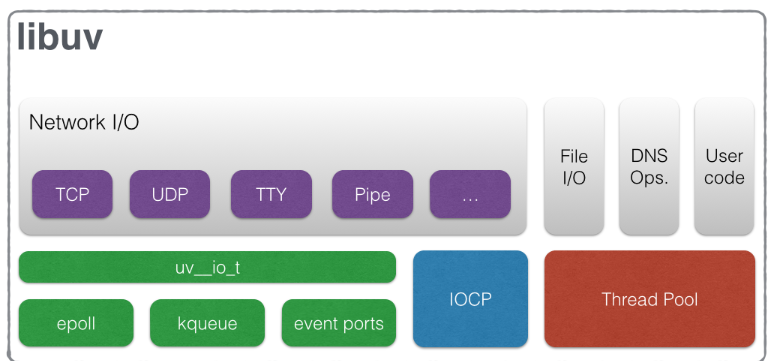

# libuv
[GitHub 저장소](https://github.com/libuv/libuv )  
[문서](https://docs.libuv.org/en/stable/  )  
  
이 문서의 글은 주로 공식 문서의 글을 바탕으로 번역,정리 된 것이다.  

## Fratures
- 모든 기능을 갖춘 이벤트 루프는 epoll, kqueue, IOCP, 이벤트 포트로 지원
- 비동기 TCP 및 UDP 소켓
- 비동기 DNS 확인
- 비동기 파일 및 파일 시스템 작업
- 파일 시스템 이벤트
- ANSI 이스케이프 코드 제어 TTY
- 소켓 공유를 통한 IPC, Unix 도메인 소켓 또는 네임드 파이프 사용(Windows)
- 하위 프로세스
- 스레드 풀
- 신호 처리
- 고해상도 클록
- 스레딩 및 동기화 기본 요소
  

## 설치 
이 [문서](https://github.com/libuv/libuv/blob/master/README.md )를 참고한다  


## Design overview
    
  
### Loop
libuv의 핵심 요소. 
Loop 하나가 하나의 thread 사용.
복수의 Loop를 사용하면 복수의 thread를 사용하는 것과 같다.
Loop 또는 핸들과 관련된 API는 thread-safe 하지 않다. 
  

## Networking
libuv에서의 네트워킹은 BSD 소켓 인터페이스를 직접 사용하는 것과 크게 다르지 않으며, 몇 가지가 더 쉽고 모두 non-blocking으로 개념은 동일하게 유지된다. 또한 libuv는 BSD 소켓 구조를 사용한 소켓 설정, DNS 조회, 다양한 소켓 매개변수 조정과 같은 성가시고 반복적이며 낮은 수준의 작업을 추상화하는 유틸리티 기능을 제공한다.  
  
uv_tcp_t 및 uv_udp_t 구조체는 네트워크 I/O에 사용된다.  
  
### TCP
TCP는 연결 지향의 스트림 프로토콜이므로 libuv 스트림 인프라를 기반으로 한다

#### Server
서버 소켓이 진행하기: 
1. `uv_tcp_init` TCP 핸들을 초기화한다.
2. `uv_tcp_bind`
3. 클라이언트에 의해 새 연결이 설정될 때마다 콜백이 호출되도록 핸들에서 `uv_listen`을 호출한다.
4. 연결을 수락하려면 `uv_accept`를 사용한다.
5. 스트림 작업을 사용하여 클라이언트와 통신한다.
  
다음은 간단한 에코 서버이다  
tcp-echo-server/main.c - listen socket  
```
        uv_close((uv_handle_t*) client, on_close);
    }
}

int main() {
    loop = uv_default_loop();

    uv_tcp_t server;
    uv_tcp_init(loop, &server);

    uv_ip4_addr("0.0.0.0", DEFAULT_PORT, &addr);

    uv_tcp_bind(&server, (const struct sockaddr*)&addr, 0);
    int r = uv_listen((uv_stream_t*) &server, DEFAULT_BACKLOG, on_new_connection);
    if (r) {
        fprintf(stderr, "Listen error %s\n", uv_strerror(r));
        return 1;
    }
    return uv_run(loop, UV_RUN_DEFAULT);
}
```
  
사람이 읽을 수 있는 IP 주소, 포트 쌍을 BSD 소켓 API에 필요한 `sockaddr_in` 구조로 변환하는 데 유틸리티 함수 `uv_ip4_addr`이 사용되는 것을 볼 수 있다. 그 반대는 `uv_ip4_name`을 사용하여 얻을 수 있다.    

대부분의 설정 함수는 CPU에 종속되므로 동기식이다. `uv_listen`은 libuv의 콜백 스타일로 돌아가는 곳이다. 두 번째 인수는 백로그 큐(대기 중인 연결의 최대 길이)이다.  
  
클라이언트에 의해 연결이 시작되면 콜백은 클라이언트 소켓에 대한 핸들을 설정하고 `uv_accept`를 사용하여 핸들을 연결해야 한다. 이 경우 이 스트림에서 읽기에 대한 관심도 설정한다.  
  
tcp-echo-server/main.c - Accepting the client  
```

    free(buf->base);
}

void on_new_connection(uv_stream_t *server, int status) {
    if (status < 0) {
        fprintf(stderr, "New connection error %s\n", uv_strerror(status));
        // error!
        return;
    }

    uv_tcp_t *client = (uv_tcp_t*) malloc(sizeof(uv_tcp_t));
    uv_tcp_init(loop, client);
    if (uv_accept(server, (uv_stream_t*) client) == 0) {
        uv_read_start((uv_stream_t*) client, alloc_buffer, echo_read);
    }
```  
나머지 함수 집합은 스트림 예제와 매우 유사하며 코드에서 찾을 수 있다. 소켓이 필요하지 않은 경우 `uv_close`를 호출하는 것만 기억하자. 연결을 수락하고 싶지 않다면 `uv_listen` 콜백에서도 이 작업을 수행할 수 있다.  
  
  
#### Client
서버에서 bind/listen/accept을 수행하는 경우 클라이언트 측에서는 단순히 `uv_tcp_connect`를 호출하기만 하면 된다. `uv_listen`과 동일한 `uv_connect_cb` 스타일의 콜백이 `uv_tcp_connect`에서 사용된다.  
```
uv_tcp_t* socket = (uv_tcp_t*)malloc(sizeof(uv_tcp_t));
uv_tcp_init(loop, socket);

uv_connect_t* connect = (uv_connect_t*)malloc(sizeof(uv_connect_t));

struct sockaddr_in dest;
uv_ip4_addr("127.0.0.1", 80, &dest);

uv_tcp_connect(connect, socket, (const struct sockaddr*)&dest, on_connect);
```  
    
여기서 `on_connect`는 연결이 설정된 후에 호출된다. 콜백은 소켓을 가리키는 `.handle` 멤버가 있는 `uv_connect_t` 구조체를 수신한다.  
   
  
### UDP
사용자 데이터그램 프로토콜은 연결이 필요 없고 신뢰할 수 없는 네트워크 통신을 제공한다. 따라서 libuv는 스트림을 제공하지 않는다. 대신 libuv는 `uv_udp_t` 핸들(수신용) 및 `uv_udp_send_t` 요청(전송용) 및 관련 함수를 통해 비차단 UDP 지원을 제공한다. 즉, 읽기/쓰기를 위한 실제 API는 일반 스트림 읽기와 매우 유사하다. UDP가 어떻게 사용되는지 살펴보기 위해 이 예제에서는 DHCP 서버에서 IP 주소를 얻는 첫 번째 단계인 DHCP Discover를 보여준다.  
  
udp-dhcp/main.c - Setup and send UDP packets  
```
uv_loop_t *loop;
uv_udp_t send_socket;
uv_udp_t recv_socket;


int main() {
    loop = uv_default_loop();

    uv_udp_init(loop, &recv_socket);
    struct sockaddr_in recv_addr;
    uv_ip4_addr("0.0.0.0", 68, &recv_addr);
    uv_udp_bind(&recv_socket, (const struct sockaddr *)&recv_addr, UV_UDP_REUSEADDR);
    uv_udp_recv_start(&recv_socket, alloc_buffer, on_read);

    uv_udp_init(loop, &send_socket);
    struct sockaddr_in broadcast_addr;
    uv_ip4_addr("0.0.0.0", 0, &broadcast_addr);
    uv_udp_bind(&send_socket, (const struct sockaddr *)&broadcast_addr, 0);
    uv_udp_set_broadcast(&send_socket, 1);

    uv_udp_send_t send_req;
    uv_buf_t discover_msg = make_discover_msg();

    struct sockaddr_in send_addr;
    uv_ip4_addr("255.255.255.255", 67, &send_addr);
    uv_udp_send(&send_req, &send_socket, &discover_msg, 1, (const struct sockaddr *)&send_addr, on_send);

    return uv_run(loop, UV_RUN_DEFAULT);
}
```   
  

#### Querying DNS
libuv는 비동기 DNS 확인을 제공합니다. 이를 위해 자체 getaddrinfo 대체 기능을 제공한다. 콜백에서 검색된 주소에 대해 일반 소켓 작업을 수행할 수 있다. Libera.chat에 연결하여 DNS 확인의 예를 살펴보겠다.    
```
int main() {
    loop = uv_default_loop();

    struct addrinfo hints;
    hints.ai_family = PF_INET;
    hints.ai_socktype = SOCK_STREAM;
    hints.ai_protocol = IPPROTO_TCP;
    hints.ai_flags = 0;

    uv_getaddrinfo_t resolver;
    fprintf(stderr, "irc.libera.chat is... ");
    int r = uv_getaddrinfo(loop, &resolver, on_resolved, "irc.libera.chat", "6667", &hints);

    if (r) {
        fprintf(stderr, "getaddrinfo call error %s\n", uv_err_name(r));
        return 1;
    }
    return uv_run(loop, UV_RUN_DEFAULT);
}
```  
   

### Network interfaces   
시스템의 네트워크 인터페이스에 대한 정보는 libuv를 통해 `uv_interface_addresses`를 사용하여 얻을 수 있다. 이 간단한 프로그램은 모든 인터페이스 세부 정보를 출력하므로 사용 가능한 필드에 대한 아이디어를 얻을 수 있다. 이는 서비스가 시작될 때 IP 주소에 바인딩할 수 있도록 하는 데 유용하다.    
interfaces/main.c    
```
#include <stdio.h>
#include <uv.h>

int main() {
    char buf[512];
    uv_interface_address_t *info;
    int count, i;

    uv_interface_addresses(&info, &count);
    i = count;

    printf("Number of interfaces: %d\n", count);
    while (i--) {
        uv_interface_address_t interface_a = info[i];

        printf("Name: %s\n", interface_a.name);
        printf("Internal? %s\n", interface_a.is_internal ? "Yes" : "No");
        
        if (interface_a.address.address4.sin_family == AF_INET) {
            uv_ip4_name(&interface_a.address.address4, buf, sizeof(buf));
            printf("IPv4 address: %s\n", buf);
        }
        else if (interface_a.address.address4.sin_family == AF_INET6) {
            uv_ip6_name(&interface_a.address.address6, buf, sizeof(buf));
            printf("IPv6 address: %s\n", buf);
        }

        printf("\n");
    }

    uv_free_interface_addresses(info, count);
    return 0;
}
```  
루프백 인터페이스의 경우 is_internal이 true 이다. 물리적 인터페이스에 여러 개의 IPv4/IPv6 주소가 있는 경우 이름은 여러 번 보고 되며 각 주소는 한 번씩 보고된다.  

  

## Threads
스레드는 내부적으로 모든 시스템 호출의 비동기 특성을 가장하기 위해 사용된다. libuv는 스레드를 생성하고 완료되면 결과를 수집하여 애플리케이션이 실제로 차단 중인 작업을 비동기적으로 수행하도록 허용하는 데에도 스레드를 사용한다.  
  
오늘날 두 가지 주요 스레드 라이브러리가 있는데, Windows 스레드 구현과 POSIX의 pthreads(7)이다. libuv의 스레드 API는 pthreads API와 유사하며 종종 유사한 의미를 갖는다.  
  
libuv의 스레드 기능에서 주목할 만한 점은 이 기능이 libuv 내에 독립된 섹션이라는 점이다. 다른 기능들이 이벤트 루프와 콜백 원칙에 밀접하게 의존하는 반면, 스레드는 완전히 독립적이며 필요에 따라 차단하고 반환 값을 통해 직접 오류를 알리고 첫 번째 예제에서 보듯이 이벤트 루프가 실행될 필요도 없다.  
  
또한 스레드의 의미와 구문이 플랫폼마다 다르고 완성도가 다르기 때문에 libuv의 스레드 API는 매우 제한적이다.  
  
이 장에서는 다음과 같은 가정을 한다: 하나의 스레드(메인 스레드)에서 실행되는 이벤트 루프가 하나만 있다. 다른 스레드는 이벤트 루프와 상호 작용하지 않는다(uv_async_send 사용 제외).  

  
### Core thread operations
여기에는 많은 것이 없으며 `uv_thread_create()`를 사용하여 스레드를 시작하고 `uv_thread_join()`을 사용하여 종료될 때까지 기다리기만 하면 된다.  
   
thread-create/main.c  
```
    int tracklen = 10;
    uv_thread_t hare_id;
    uv_thread_t tortoise_id;
    uv_thread_create(&hare_id, hare, &tracklen);
    uv_thread_create(&tortoise_id, tortoise, &tracklen);

    uv_thread_join(&hare_id);
    uv_thread_join(&tortoise_id);
    return 0;
}
```     
두 번째 매개변수는 스레드의 진입점 역할을 하는 함수이고, 마지막 매개변수는 사용자 정의 매개변수를 스레드에 전달하는 데 사용할 수 있는 `void *` 인수이다. 이제 함수 hare는 운영 체제에 의해 미리 예약된 별도의 스레드에서 실행된다:
    

thread-create/main.c  
```
    int tracklen = *((int *) arg);
    while (tracklen) {
        tracklen--;
        uv_sleep(1000);
        fprintf(stderr, "Hare ran another step\n");
    }
    fprintf(stderr, "Hare done running!\n");
}
```  
대상 스레드가 두 번째 매개변수를 사용하여 호출 스레드에 값을 다시 전달할 수 있는 pthread_join()과 달리, uv_thread_join()은 그렇지 않다. 값을 전송하려면 [스레드 간 통신](https://docs.libuv.org/en/stable/guide/threads.html#inter-thread-communication )을 사용한다.
  
  
### Synchronization Primitives
이 책은 스레드에 관한 책이 아니므로 여기서는 libuv API의 놀라운 기능만 소개한다. 나머지는 [pthreads(7)](https://man7.org/linux/man-pages/man7/pthreads.7.html ) 매뉴얼 페이지를 보면 된다.  
  
#### Mutexes
libuv mutex functions  
```
int uv_mutex_init(uv_mutex_t* handle);
int uv_mutex_init_recursive(uv_mutex_t* handle);
void uv_mutex_destroy(uv_mutex_t* handle);
void uv_mutex_lock(uv_mutex_t* handle);
int uv_mutex_trylock(uv_mutex_t* handle);
void uv_mutex_unlock(uv_mutex_t* handle);
```  
`uv_mutex_init()`, `uv_mutex_init_recursive()` 및 `uv_mutex_trylock()` 함수는 성공하면 0을 반환하고, 그렇지 않으면 오류 코드를 반환한다.  
  
디버깅이 활성화된 상태에서 libuv를 컴파일한 경우, 오류 시 `uv_mutex_destroy()`, `uv_mutex_lock()`, `uv_mutex_unlock()`이 abort() 된다. 마찬가지로 `uv_mutex_trylock()`은 에러가 `EAGAIN` 또는 `EBUSY`가 아닌 다른 에러인 경우 중단된다.  
  
재귀 뮤텍스는 지원되지만 이에 의존해서는 안 된다. 또한 `uv_cond_t` 변수와 함께 사용해서는 안 된다.  
  
기본 BSD 뮤텍스 구현은 뮤텍스를 잠근 스레드가 다시 잠그려고 시도하면 에러를 발생시킨다. 예를 들어, 다음과 같은 구조체가 있다:  
```
uv_mutex_init(a_mutex);
uv_mutex_lock(a_mutex);
uv_thread_create(thread_id, entry, (void *)a_mutex);
uv_mutex_lock(a_mutex);
// more things here
```  
를 사용하면 다른 스레드가 일부 항목을 초기화한 다음 `a_mutex`를 잠금 해제할 때까지 기다릴 수 있지만 디버그 모드인 경우 프로그램이 충돌하거나 `uv_mutex_lock()`을 두 번째로 호출할 때 오류가 반환될 수 있다.    

     
#### LOCKs
읽기-쓰기 잠금은 보다 세분화된 액세스 메커니즘이다. 두 명의 리더가 동시에 공유 메모리에 액세스할 수 있다. 쓰기는 읽기가 잠금을 잡고 있을 때 잠금을 획득할 수 없다. 쓰기자가 잠금을 잡고 있으면 읽기 또는 쓰기는 잠금을 획득할 수 없다. 읽기-쓰기 잠금은 데이터베이스에서 자주 사용된다. 다음은 장난감의 예이다.    
    
locks/main.c - simple rwlocks  
```
#include <stdio.h>
#include <uv.h>

uv_barrier_t blocker;
uv_rwlock_t numlock;
int shared_num;

void reader(void *n)
{
    int num = *(int *)n;
    int i;
    for (i = 0; i < 20; i++) {
        uv_rwlock_rdlock(&numlock);
        printf("Reader %d: acquired lock\n", num);
        printf("Reader %d: shared num = %d\n", num, shared_num);
        uv_rwlock_rdunlock(&numlock);
        printf("Reader %d: released lock\n", num);
    }
    uv_barrier_wait(&blocker);
}

void writer(void *n)
{
    int num = *(int *)n;
    int i;
    for (i = 0; i < 20; i++) {
        uv_rwlock_wrlock(&numlock);
        printf("Writer %d: acquired lock\n", num);
        shared_num++;
        printf("Writer %d: incremented shared num = %d\n", num, shared_num);
        uv_rwlock_wrunlock(&numlock);
        printf("Writer %d: released lock\n", num);
    }
    uv_barrier_wait(&blocker);
}

int main()
{
    uv_barrier_init(&blocker, 4);

    shared_num = 0;
    uv_rwlock_init(&numlock);

    uv_thread_t threads[3];

    int thread_nums[] = {1, 2, 1};
    uv_thread_create(&threads[0], reader, &thread_nums[0]);
    uv_thread_create(&threads[1], reader, &thread_nums[1]);

    uv_thread_create(&threads[2], writer, &thread_nums[2]);

    uv_barrier_wait(&blocker);
    uv_barrier_destroy(&blocker);

    uv_rwlock_destroy(&numlock);
    return 0;
}
```  
이 기능을 실행하고 독자가 때때로 어떻게 겹치는지 관찰하자. 작성자가 여러 명인 경우 스케줄러는 일반적으로 더 높은 우선순위를 부여하므로 두 명의 작성자를 추가하면 두 작성자가 독자가 다시 기회를 얻기 전에 먼저 완료하는 경향이 있음을 알 수 있다.  
  
또한 위의 예에서는 메인 스레드가 모든 리더와 작성자가 끝났다는 표시를 할 때까지 기다릴 수 있도록 배리어를 사용했다.  
  
#### Others  
libuv는 또한 세마포어, 조건 변수 및 배리어를 지원하며, pthread와 매우 유사한 API를 제공한다.  
  
또한 libuv는 편의 함수인 `uv_once()`를 제공한다. 여러 스레드가 주어진 가드와 함수 포인터로 `uv_once()` 호출을 시도할 수 있으며, 첫 번째 스레드만 승리하고 함수는 한 번만 호출된다:    
```
/* Initialize guard */
static uv_once_t once_only = UV_ONCE_INIT;

int i = 0;

void increment() {
    i++;
}

void thread1() {
    /* ... work */
    uv_once(once_only, increment);
}

void thread2() {
    /* ... work */
    uv_once(once_only, increment);
}

int main() {
    /* ... spawn threads */
}
```  
모든 스레드가 완료되면 `i == 1`이 된다.  
  
libuv v0.11.11 이후 버전에서는 스레드 로컬 저장소를 위한 `uv_key_t` 구조체와 API도 추가되었다.
  
  
### libuv work queue
`uv_queue_work()`는 애플리케이션이 별도의 스레드에서 작업을 실행하고 작업이 완료되면 트리거되는 콜백을 가질 수 있도록 하는 편의 함수이다. 겉보기에는 단순한 함수인 `uv_queue_work()`가 매력적인 이유는 이벤트 루프 패러다임과 함께 모든 서드파티 라이브러리를 사용할 수 있다는 점이다. 이벤트 루프를 사용할 때는 루프 스레드에서 주기적으로 실행되는 함수가 I/O를 수행할 때 차단되거나 심각한 CPU 훅이 되지 않도록 해야 하는데, 이는 루프가 느려지고 이벤트가 최대 용량으로 처리되지 않는다는 것을 의미하기 때문이다.    
    
그러나 기존의 많은 코드는 응답성을 원하는 경우(고전적인 '클라이언트당 하나의 스레드' 서버 모델) 스레드와 함께 사용할 수 있는 함수(예: 내부에서 I/O를 수행하는 루틴)를 차단하는 기능을 제공하며, 이벤트 루프 라이브러리와 함께 사용하려면 일반적으로 별도의 스레드에서 작업을 실행하는 자체 시스템을 롤링해야 한다. libuv는 이를 위한 편리한 추상화를 제공할 뿐이다.  
  
다음은 node.js에서 영감을 얻은 간단한 예제입니다. 피보나치 수를 계산하고, 그 과정에서 약간의 잠을 자지만, 차단 및 CPU 바운드 작업으로 인해 이벤트 루프가 다른 활동을 수행하지 못하도록 별도의 스레드에서 실행한다.  
  
queue-work/main.c - lazy fibonacci  
```
void fib(uv_work_t *req) {
    int n = *(int *) req->data;
    if (random() % 2)
        sleep(1);
    else
        sleep(3);
    long fib = fib_(n);
    fprintf(stderr, "%dth fibonacci is %lu\n", n, fib);
}

void after_fib(uv_work_t *req, int status) {
    fprintf(stderr, "Done calculating %dth fibonacci\n", *(int *) req->data);
}
```  
실제 작업 함수는 간단하며 별도의 스레드에서 실행된다는 것을 보여줄 것이 없다. uv_work_t 구조체가 단서이다. void* 데이터 필드를 사용하여 임의의 데이터를 전달하고 스레드와 통신하는 데 사용할 수 있다. 하지만 두 스레드가 모두 실행 중인 상태에서 변경하는 경우 적절한 잠금을 사용하고 있는지 확인하자.  
  
트리거는 uv_queue_work 이다:    
queue-work/main.c  
```
int main() {
    loop = uv_default_loop();

    int data[FIB_UNTIL];
    uv_work_t req[FIB_UNTIL];
    int i;
    for (i = 0; i < FIB_UNTIL; i++) {
        data[i] = i;
        req[i].data = (void *) &data[i];
        uv_queue_work(loop, &req[i], fib, after_fib);
    }

    return uv_run(loop, UV_RUN_DEFAULT);
}
```  
   
스레드 함수는 별도의 스레드에서 실행되고, `uv_work_t` 구조가 전달되며, 함수가 반환되면 이벤트 루프가 실행 중인 스레드에서 애프터 함수가 호출된다. 동일한 구조체가 전달된다.  
  
블로킹 라이브러리에 래퍼를 작성할 때 일반적인 패턴은 배턴을 사용하여 데이터를 교환하는 것이다.  
  
libuv 버전 0.9.4부터 추가 함수인 `uv_cancel()`을 사용할 수 있다. 이 함수를 사용하면 libuv 작업 대기열에 있는 작업을 취소할 수 있다. 아직 시작되지 않은 작업만 취소할 수 있다. 작업이 이미 실행을 시작했거나 실행이 완료된 경우 `uv_cancel()`은 실패한다.   
  
사용자가 종료를 요청하는 경우 `uv_cancel()`은 보류 중인 작업을 정리하는 데 유용하다. 예를 들어, 음악 플레이어는 오디오 파일을 검색하기 위해 여러 디렉터리를 대기열에 대기시킬 수 있다. 사용자가 프로그램을 종료하면 보류 중인 모든 요청이 실행될 때까지 기다리지 않고 빠르게 종료해야 한다.  
  
피보나치 예제를 수정하여 uv_cancel()을 시연해 보겠다. 먼저 종료에 대한 시그널 핸들러를 설정한다.  
queue-cancel/main.c    
```
int main() {
    loop = uv_default_loop();

    int data[FIB_UNTIL];
    int i;
    for (i = 0; i < FIB_UNTIL; i++) {
        data[i] = i;
        fib_reqs[i].data = (void *) &data[i];
        uv_queue_work(loop, &fib_reqs[i], fib, after_fib);
    }

    uv_signal_t sig;
    uv_signal_init(loop, &sig);
    uv_signal_start(&sig, signal_handler, SIGINT);

    return uv_run(loop, UV_RUN_DEFAULT);
}
```  
사용자가 Ctrl+C를 눌러 신호를 트리거하면 모든 워커에 uv_cancel()을 전송한다. 이미 실행 중이거나 완료된 워커에 대해서는 uv_cancel()이 0을 반환한다.  
  
  
### Inter-thread communication
여러 스레드가 실행되는 동안 실제로 서로 메시지를 주고받기를 원할 때가 있다. 예를 들어 별도의 스레드(예: uv_queue_work 사용)에서 오래 걸리는 작업을 실행하고 있지만 진행 상황을 메인 스레드에 알리고 싶을 수 있다. 다운로드 관리자가 사용자에게 다운로드 실행 상태를 알려주는 간단한 예시이다.    
progress/main.c    
```
uv_loop_t *loop;
uv_async_t async;

int main() {
    loop = uv_default_loop();

    uv_work_t req;
    int size = 10240;
    req.data = (void*) &size;

    uv_async_init(loop, &async, print_progress);
    uv_queue_work(loop, &req, fake_download, after);

    return uv_run(loop, UV_RUN_DEFAULT);
}
```  
비동기 스레드 통신은 루프에서 작동하므로 모든 스레드가 메시지 발신자가 될 수 있지만 libuv 루프가 있는 스레드만 수신자가 될 수 있다(또는 오히려 루프가 수신자). libuv는 메시지를 수신할 때마다 비동기 감시자와 함께 콜백(print_progress)을 호출한다.  
  
progress/main.c  
```
double percentage;

void fake_download(uv_work_t *req) {
    int size = *((int*) req->data);
    int downloaded = 0;
    while (downloaded < size) {
        percentage = downloaded*100.0/size;
        async.data = (void*) &percentage;
        uv_async_send(&async);

        sleep(1);
        downloaded += (200+random())%1000; // can only download max 1000bytes/sec,
                                           // but at least a 200;
    }
}
```  
다운로드 기능에서는 진행률 표시기를 수정하고 `uv_async_send`로 메시지를 전달하기 위해 대기열에 대기시킨다. `uv_async_send`도 차단되지 않으며 즉시 반환된다는 점을 기억하자.   
progress/main.c  
```
void print_progress(uv_async_t *handle) {
    double percentage = *((double*) handle->data);
    fprintf(stderr, "Downloaded %.2f%%\n", percentage);
}
```  

콜백은 표준 리부브 패턴으로, 감시자로부터 데이터를 추출한다.  
마지막으로 와처를 정리하는 것을 기억하는 것이 중요하다.  
progress/main.c  
```
void after(uv_work_t *req, int status) {
    fprintf(stderr, "Download complete\n");
    uv_close((uv_handle_t*) &async, NULL);
}
```  
데이터 필드의 남용을 보여준 이 예제 이후, [bnoordhuis](https://github.com/bnoordhuis )는 데이터 필드를 사용하는 것은 스레드 안전하지 않으며, `uv_async_send()`는 실제로 이벤트 루프를 깨우기 위한 것일 뿐이라고 지적했다. 뮤텍스 또는 rwlock을 사용하여 액세스가 올바른 순서로 수행되도록 하자.  
  
  
  
## Processes
https://docs.libuv.org/en/stable/guide/processes.html  
  
  
  
## Advanced event loops
libuv는 이벤트 루프에 대한 상당한 사용자 제어 기능을 제공하며, 여러 개의 루프를 저글링하여 흥미로운 결과를 얻을 수 있다. libuv의 이벤트 루프를 다른 이벤트 루프 기반 라이브러리에 임베드할 수도 있다. Qt 기반 UI와 집중적인 시스템 수준 작업을 수행하는 libuv 백엔드를 구동하는 Qt의 이벤트 루프를 상상해 보자.    
    
### Stopping an event loop
`uv_stop()`을 사용하여 이벤트 루프를 중지할 수 있다. 루프가 실행을 멈추는 가장 빠른 시점은 다음 반복일 수 있으며, 그 이후일 수도 있다. 즉, 이 루프 반복에서 처리할 준비가 된 이벤트는 계속 처리되므로 `uv_stop()`을 킬 스위치로 사용할 수 없다. `uv_stop()`이 호출되면 루프는 이 반복에서 I/O를 차단하지 않는다. 이러한 것들의 의미는 약간 이해하기 어려울 수 있으므로 모든 제어 흐름이 발생하는 `uv_run()`을 살펴 보겠다.  
    
src/unix/core.c - uv_run    
```
  switch (handle->type) {
    case UV_PREPARE:
    case UV_CHECK:
    case UV_IDLE:
    case UV_ASYNC:
    case UV_TIMER:
    case UV_PROCESS:
    case UV_FS_EVENT:
    case UV_FS_POLL:
    case UV_POLL:
      break;

    case UV_SIGNAL:
      /* If there are any caught signals "trapped" in the signal pipe,
       * we can't call the close callback yet. Reinserting the handle
       * into the closing queue makes the event loop spin but that's
       * okay because we only need to deliver the pending events.
       */
      sh = (uv_signal_t*) handle;
      if (sh->caught_signals > sh->dispatched_signals) {
```  
  
`stop_flag`는 `uv_stop()`에 의해 설정된다. 이제 모든 libuv 콜백은 이벤트 루프 내에서 호출되므로, 이벤트 루프에서 `uv_stop()`을 호출해도 이 루프 반복이 계속 발생한다. 먼저 libuv는 타이머를 업데이트한 다음 보류 중인 타이머, 유휴 및 준비 콜백을 실행하고 보류 중인 모든 I/O 콜백을 호출한다. 이 중 하나에서 `uv_stop()`을 호출하면 stop_flag가 설정된다. 이로 인해 `uv_backend_timeout()`이 0을 반환하므로 루프가 I/O를 차단하지 않는다. 반면에 검사 핸들러 중 하나에서 `uv_stop()`을 호출한 경우 I/O는 이미 완료되었으므로 영향을 받지 않는다.

`uv_stop()`은 결과가 계산되었거나 오류가 있을 때 모든 핸들러를 일일이 중지할 필요 없이 루프를 종료하는 데 유용한다.  
  
다음은 루프를 중지하고 루프의 현재 반복이 어떻게 계속 진행되는지 보여주는 간단한 예제이다.  
uvstop/main.c  
```
#include <stdio.h>
#include <uv.h>

int64_t counter = 0;

void idle_cb(uv_idle_t *handle) {
    printf("Idle callback\n");
    counter++;

    if (counter >= 5) {
        uv_stop(uv_default_loop());
        printf("uv_stop() called\n");
    }
}

void prep_cb(uv_prepare_t *handle) {
    printf("Prep callback\n");
}

int main() {
    uv_idle_t idler;
    uv_prepare_t prep;

    uv_idle_init(uv_default_loop(), &idler);
    uv_idle_start(&idler, idle_cb);

    uv_prepare_init(uv_default_loop(), &prep);
    uv_prepare_start(&prep, prep_cb);

    uv_run(uv_default_loop(), UV_RUN_DEFAULT);

    return 0;
}
```     
  
  
  
## Utilities
이 장에서는 일반적인 작업에 유용한 도구와 기법을 소개한다. 간단한 API 변경을 통해 libuv에 적용할 수 있는 몇 가지 패턴은 이미 [libev man 페이지](http://pod.tst.eu/http://cvs.schmorp.de/libev/ev.pod#COMMON_OR_USEFUL_IDIOMS_OR_BOTH )에서 다루고 있다. 또한 전체 챕터에서 다룰 필요가 없는 libuv API의 일부도 다루고 있다.  
    
### Timers  
타이머는 타이머가 시작된 후 일정 시간이 경과하면 콜백을 호출한다. libuv 타이머는 한 번만 호출하는 것이 아니라 일정한 간격으로 호출하도록 설정할 수도 있다.  
  
워처를 초기화하고 타임아웃으로 시작하고 선택적으로 반복하는 간단한 사용법이 있다. 타이머는 언제든지 중지할 수 있다.  
```  
uv_timer_t timer_req;

uv_timer_init(loop, &timer_req);
uv_timer_start(&timer_req, callback, 5000, 2000);
```  
는 반복 타이머를 시작하며, 이 타이머는 uv_timer_start 실행 후 5초( 타임아웃) 후에 처음 시작되고 2초마다 반복된다(반복). 사용:  
```
uv_timer_stop(&timer_req);
```  
를 사용하여 타이머를 중지할 수 있다. 이 기능은 콜백 내에서도 안전하게 사용할 수 있다.  
  
반복 간격은 다음을 사용하여 언제든지 수정할 수 있다:  
```
uv_timer_set_repeat(uv_timer_t *timer, int64_t repeat);
```  
를 호출하여 가능한 경우 적용한다. 이 함수가 타이머 콜백에서 호출되는 경우 이 함수는
- 타이머가 반복되지 않는 경우 타이머가 이미 중지된 것이다. `uv_timer_start`를 다시 사용한다.
- 타이머가 반복되는 경우 다음 타임아웃이 이미 예약되어 있으므로 타이머가 새 간격으로 전환되기 전에 이전 반복 간격이 한 번 더 사용된다.
  
    
유틸리티 함수이다:  
```
int uv_timer_again(uv_timer_t *)
```  
는 반복 타이머에만 적용되며 타이머를 중지한 다음 초기 타임아웃과 반복을 모두 이전 반복 값으로 설정한 상태로 타이머를 시작하는 것과 동일하다. 타이머가 시작되지 않으면 실패(오류 코드 `UV_EINVAL`)하고 -1을 반환한다.
  
  
### 이벤트 루프 참조 
이벤트 루프는 활성 핸들이 있는 동안에만 실행된다. 이 시스템은 모든 핸들이 시작될 때 이벤트 루프의 참조 횟수를 늘리고 중지될 때 참조 횟수를 줄이는 방식으로 작동한다. 다음을 사용하여 핸들의 참조 횟수를 수동으로 변경할 수도 있다:  
```
void uv_ref(uv_handle_t*);
void uv_unref(uv_handle_t*);
```  
이러한 함수를 사용하여 감시자가 활성화되어 있어도 루프가 종료되도록 하거나 사용자 지정 개체를 사용하여 루프를 계속 유지하도록 할 수 있다.  
  
후자는 간격 타이머와 함께 사용할 수 있다. X초 마다 실행되는 가비지 수집기가 있거나 네트워크 서비스에서 주기적으로 다른 사용자에게 하트비트를 보낼 수 있지만 모든 깨끗한 종료 경로 또는 오류 시나리오에서 이를 중지하고 싶지는 않을 수 있다. 또는 다른 감시자가 모두 완료되면 프로그램이 종료되도록 하고 싶을 수도 있다. 이 경우 생성 직후 타이머를 참조 해제하면 실행 중인 유일한 감시자라도 `uv_run`이 계속 종료된다.  
  
이는 일부 libuv 메서드가 JS API로 버블링되는 node.js에서도 사용된다. 모든 워처의 슈퍼클래스인 `uv_handle_t`는 JS 객체마다 생성되며 참조/비참조할 수 있다.  
    
ref-timer/main.c    
```
uv_loop_t *loop;
uv_timer_t gc_req;
uv_timer_t fake_job_req;

int main() {
    loop = uv_default_loop();

    uv_timer_init(loop, &gc_req);
    uv_unref((uv_handle_t*) &gc_req);

    uv_timer_start(&gc_req, gc, 0, 2000);

    // could actually be a TCP download or something
    uv_timer_init(loop, &fake_job_req);
    uv_timer_start(&fake_job_req, fake_job, 9000, 0);
    return uv_run(loop, UV_RUN_DEFAULT);
}
```  
가비지 컬렉터 타이머를 초기화한 다음 즉시 참조를 해제한다. 9초 후 가짜 작업이 완료되면 가비지 수집기가 계속 실행 중임에도 불구하고 프로그램이 자동으로 종료되는 것을 관찰한다.  
  

#### Idler pattern
유휴 핸들의 콜백은 이벤트 루프당 한 번 호출된다. 유휴 콜백은 우선순위가 매우 낮은 활동을 수행하는 데 사용할 수 있다. 예를 들어, 유휴 기간 동안 분석을 위해 개발자에게 일일 애플리케이션 성능 요약을 보내거나 애플리케이션의 CPU 시간을 사용하여 SETI 계산을 수행할 수 있다. 유휴 감시기는 GUI 애플리케이션에서도 유용하다. 파일 다운로드에 이벤트 루프를 사용한다고 가정해 보자. TCP 소켓이 아직 설정 중이고 다른 이벤트가 없는 경우 이벤트 루프가 일시 중지(차단)되어 진행률 표시줄이 멈추고 사용자가 응답하지 않는 애플리케이션을 보게 된다. 이러한 경우 대기열에 대기하고 유휴 상태의 감시자를 설정하여 UI가 계속 작동하도록 하자.  
  
idle-compute/main.c  
```
uv_loop_t *loop;
uv_fs_t stdin_watcher;
uv_idle_t idler;
char buffer[1024];

int main() {
    loop = uv_default_loop();

    uv_idle_init(loop, &idler);

    uv_buf_t buf = uv_buf_init(buffer, 1024);
    uv_fs_read(loop, &stdin_watcher, 0, &buf, 1, -1, on_type);
    uv_idle_start(&idler, crunch_away);
    return uv_run(loop, UV_RUN_DEFAULT);
}
```  
여기서 우리는 유휴 감시자를 초기화하고 관심 있는 실제 이벤트와 함께 대기열에 대기시킨다. 이제 사용자가 무언가를 입력하고 Return을 누를 때까지 crunch_away가 반복적으로 호출된다. 그런 다음 루프가 입력 데이터를 처리하는 동안 잠시 중단된 후 다시 유휴 콜백을 계속 호출한다.  
  
idle-compute/main.c  
```
void crunch_away(uv_idle_t* handle) {
    // Compute extra-terrestrial life
    // fold proteins
    // computer another digit of PI
    // or similar
    fprintf(stderr, "Computing PI...\n");
    // just to avoid overwhelming your terminal emulator
    uv_idle_stop(handle);
}
```  
  

#### 워커 스레드에 데이터 전달
`uv_queue_work`를 사용할 때는 일반적으로 복잡한 데이터를 작업자 스레드에 전달해야 한다. 해결책은 구조체를 사용하고 `uv_work_t.data`가 이를 가리키도록 설정하는 것이다. 약간의 변형은 이 구조체의 첫 번째 멤버(baton 이라고 함)로uv_work_t 자체를 사용하는 것이다. 이렇게 하면 작업 요청과 모든 데이터를 한 번의 무료 호출로 정리할 수 있다.  
```
struct ftp_baton {
    uv_work_t req;
    char *host;
    int port;
    char *username;
    char *password;
}
```  
```
ftp_baton *baton = (ftp_baton*) malloc(sizeof(ftp_baton));
baton->req.data = (void*) baton;
baton->host = strdup("my.webhost.com");
baton->port = 21;
// ...

uv_queue_work(loop, &baton->req, ftp_session, ftp_cleanup);
```  
  
여기에서 baton을 생성하고 작업을 대기열에 추가한다.  
이제 작업 함수가 필요한 데이터를 추출할 수 있다:  
```
void ftp_session(uv_work_t *req) {
    ftp_baton *baton = (ftp_baton*) req->data;

    fprintf(stderr, "Connecting to %s\n", baton->host);
}

void ftp_cleanup(uv_work_t *req) {
    ftp_baton *baton = (ftp_baton*) req->data;

    free(baton->host);
    // ...
    free(baton);
}
```  

그런 다음 baton을 놓으면 감시자도 자유로워진다.  

### 외부 I/O polling
일반적으로 타사 라이브러리는 자체 I/O를 처리하고 내부적으로 소켓과 기타 파일을 추적한다. 이 경우 표준 스트림 I/O 연산을 사용할 수는 없지만 라이브러리는 여전히 libuv 이벤트 루프에 통합될 수 있다. 필요한 것은 라이브러리가 기본 파일 기술자에 액세스할 수 있도록 허용하고 애플리케이션에서 결정한 대로 작업을 조금씩 처리하는 함수를 제공하기만 하면 된다. 하지만 일부 라이브러리는 이러한 액세스를 허용하지 않고 전체 I/O 트랜잭션을 수행한 다음 반환하는 표준 차단 기능만 제공한다. 이벤트 루프 스레드에서 이러한 기능을 사용하는 것은 현명하지 않으며 대신 스레드 풀 작업 스케줄링을 사용하자. 물론 이렇게 하면 라이브러리에 대한 세분화된 제어권을 잃게 된다.  
  
libuv의 `uv_poll` 섹션은 단순히 운영체제의 알림 메커니즘을 사용해 파일 기술자를 감시한다. 어떤 의미에서 libuv가 자체적으로 구현하는 모든 I/O 작업도 `uv_poll`과 같은 코드에 의해 뒷받침된다. OS가 폴링 중인 파일 기술자의 상태 변경을 감지할 때마다 libuv는 관련 콜백을 호출한다.  
  
여기서는 libcurl을 사용해 파일을 다운로드하는 간단한 다운로드 관리자를 살펴보겠다. libcurl에 모든 제어권을 부여하는 대신 libuv 이벤트 루프를 사용하고, 비차단 비동기 멀티 인터페이스를 사용하여 libuv가 I/O 준비 상태를 알릴 때마다 다운로드를 진행하겠다.  
  
uvwget/main.c - 설정   
```
#include <assert.h>
#include <stdio.h>
#include <stdlib.h>
#include <uv.h>
#include <curl/curl.h>

uv_loop_t *loop;
CURLM *curl_handle;
uv_timer_t timeout;
int main(int argc, char **argv) {
    loop = uv_default_loop();

    if (argc <= 1)
        return 0;

    if (curl_global_init(CURL_GLOBAL_ALL)) {
        fprintf(stderr, "Could not init cURL\n");
        return 1;
    }

    uv_timer_init(loop, &timeout);

    curl_handle = curl_multi_init();
    curl_multi_setopt(curl_handle, CURLMOPT_SOCKETFUNCTION, handle_socket);
    curl_multi_setopt(curl_handle, CURLMOPT_TIMERFUNCTION, start_timeout);

    while (argc-- > 1) {
        add_download(argv[argc], argc);
    }

    uv_run(loop, UV_RUN_DEFAULT);
    curl_multi_cleanup(curl_handle);
    return 0;
}
```  
각 라이브러리가 libuv와 통합되는 방식은 다를 수 있다. libcurl의 경우 두 개의 콜백을 등록할 수 있다. 소켓 콜백 `handle_socket`은소켓의 상태가 변경되어 폴링을 시작해야 할 때마다 호출된다. `start_timeout`은 다음 타임아웃 간격을 알리기 위해 libcurl이 호출하며, 그 이후에는 I/O 상태와 관계없이 libcurl을 앞으로 진행해야 한다. 이는 libcurl이 오류를 처리하거나 다운로드 진행에 필요한 다른 모든 작업을 할 수 있도록 하기 위한 것이다.  
  
다운로더는 다음과 같이 호출된다:  
```
$ ./uvwget [url1] [url2] ...
```  
따라서 각 인수를 URL로 추가한다.  
  
uvwget/main.c - URL 추가하기    
```
void add_download(const char *url, int num) {
    char filename[50];
    sprintf(filename, "%d.download", num);
    FILE *file;

    file = fopen(filename, "w");
    if (file == NULL) {
        fprintf(stderr, "Error opening %s\n", filename);
        return;
    }

    CURL *handle = curl_easy_init();
    curl_easy_setopt(handle, CURLOPT_WRITEDATA, file);
    curl_easy_setopt(handle, CURLOPT_URL, url);
    curl_multi_add_handle(curl_handle, handle);
    fprintf(stderr, "Added download %s -> %s\n", url, filename);
}
```  
libcurl이 직접 파일에 데이터를 쓸 수 있도록 했지만, 원하는 경우 훨씬 더 많은 기능을 사용할 수 있다.

시작_타임아웃은 libcurl이 처음 호출할 때 즉시 호출되므로 동작이 시작된다. 이것은 단순히 libuv 타이머를 시작하여 시간이 초과될 때마다 curl_socket_timeout으로 curl_multi_socket_action을 구동한다. curl_multi_socket_action은 libcurl을 구동하고 소켓의 상태가 변경될 때마다 호출하는 것이다. 하지만 그 전에 handle_socket이 호출될 때마다 소켓에 대한 폴링이 필요하다.  
  
uvwget/main.c - polling 설정하기  
```
void start_timeout(CURLM *multi, long timeout_ms, void *userp) {
    if (timeout_ms <= 0)
        timeout_ms = 1; /* 0 means directly call socket_action, but we'll do it in a bit */
    uv_timer_start(&timeout, on_timeout, timeout_ms, 0);
}

int handle_socket(CURL *easy, curl_socket_t s, int action, void *userp, void *socketp) {
    curl_context_t *curl_context;
    if (action == CURL_POLL_IN || action == CURL_POLL_OUT) {
        if (socketp) {
            curl_context = (curl_context_t*) socketp;
        }
        else {
            curl_context = create_curl_context(s);
            curl_multi_assign(curl_handle, s, (void *) curl_context);
        }
    }

    switch (action) {
        case CURL_POLL_IN:
            uv_poll_start(&curl_context->poll_handle, UV_READABLE, curl_perform);
            break;
        case CURL_POLL_OUT:
            uv_poll_start(&curl_context->poll_handle, UV_WRITABLE, curl_perform);
            break;
        case CURL_POLL_REMOVE:
            if (socketp) {
                uv_poll_stop(&((curl_context_t*)socketp)->poll_handle);
                destroy_curl_context((curl_context_t*) socketp);                
                curl_multi_assign(curl_handle, s, NULL);
            }
            break;
        default:
            abort();
    }

    return 0;
}
```  
우리는 소켓 fd s와 액션에 관심이 있다. 모든 소켓에 대해 `uv_poll_t` 핸들이 존재하지 않는 경우 이를 생성하고 curl_multi_assign을 사용하여 소켓과 연결한다. 이렇게 하면 콜백이 호출될 때마다 소켓p가 이를 가리킨다.  
  
다운로드가 완료되었거나 실패한 경우, libcurl은 폴링 제거를 요청한다. 따라서 폴링 핸들을 중지하고 해제한다.  
  
libcurl이 감시하고자 하는 이벤트에 따라, 우리는 `UV_READABLE` 또는 `UV_WRITABLE`로 폴링을 시작한다. 이제 소켓이 읽기 또는 쓰기 준비가 될 때마다 libuv는 폴링 콜백을 호출한다. 동일한 핸들에서 `uv_poll_start`를 여러 번 호출해도 괜찮으며, 이벤트 마스크를 새 값으로 업데이트할 뿐이다. curl_perform이 이 프로그램의 핵심이다.  
  
uvwget/main.c - libcurl을 구동한다  
```
void curl_perform(uv_poll_t *req, int status, int events) {
    uv_timer_stop(&timeout);
    int running_handles;
    int flags = 0;
    if (status < 0)                      flags = CURL_CSELECT_ERR;
    if (!status && events & UV_READABLE) flags |= CURL_CSELECT_IN;
    if (!status && events & UV_WRITABLE) flags |= CURL_CSELECT_OUT;

    curl_context_t *context;

    context = (curl_context_t*)req;

    curl_multi_socket_action(curl_handle, context->sockfd, flags, &running_handles);
    check_multi_info();   
}
```  
가장 먼저 할 일은 간격이 어느 정도 진행되었으므로 타이머를 중지하는 것이다. 그런 다음 콜백을 트리거한 이벤트에 따라 올바른 플래그를 설정한다. 그런 다음 진행 중인 소켓과 어떤 이벤트가 발생했는지 알려주는 플래그를 사용하여 curl_multi_socket_action을 호출한다. 이 시점에서 libcurl은 모든 내부 작업을 조금씩 조금씩 수행하며 가능한 한 빨리 반환하려고 시도하는데, 이는 이벤트가 발생한 프로그램이 메인 스레드에서 원하는 것과 정확히 일치한다. libcurl은 전송 진행 상황에 대한 메시지를 자체 큐에 계속 큐에 대기시킨다. 우리의 경우에는 완료된 전송에만 관심이 있다. 따라서 이러한 메시지를 추출하고 전송이 완료된 핸들을 정리한다.  
  
uvwget/main.c - 전송 상태 읽기.  
```
void check_multi_info(void) {
    char *done_url;
    CURLMsg *message;
    int pending;

    while ((message = curl_multi_info_read(curl_handle, &pending))) {
        switch (message->msg) {
        case CURLMSG_DONE:
            curl_easy_getinfo(message->easy_handle, CURLINFO_EFFECTIVE_URL,
                            &done_url);
            printf("%s DONE\n", done_url);

            curl_multi_remove_handle(curl_handle, message->easy_handle);
            curl_easy_cleanup(message->easy_handle);
            break;

        default:
            fprintf(stderr, "CURLMSG default\n");
            abort();
        }
    }
}
```  
  

### Check & Prepare watchers
https://docs.libuv.org/en/stable/guide/utilities.html#check-prepare-watchers 


### 라이브러리 로드 
https://docs.libuv.org/en/stable/guide/utilities.html#loading-libraries  

  
### TTY
https://docs.libuv.org/en/stable/guide/utilities.html#tty  

